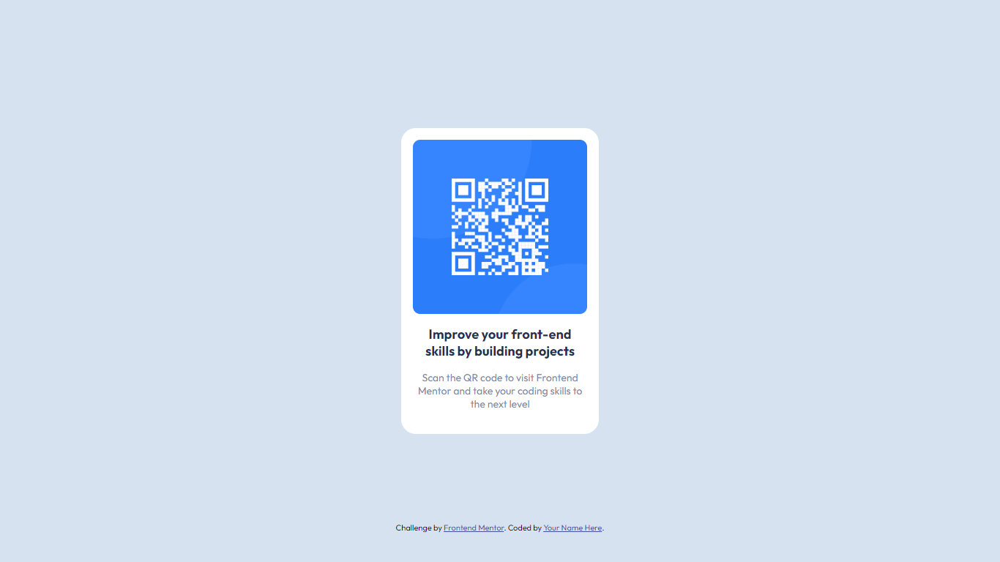

# Frontend Mentor - QR code component solution

This is a solution to the [QR code component challenge on Frontend Mentor](https://www.frontendmentor.io/challenges/qr-code-component-iux_sIO_H). Frontend Mentor challenges help you improve your coding skills by building realistic projects. 

## Table of contents

- [Overview](#overview)
  - [Screenshot](#screenshot)
  - [Links](#links)
- [My process](#my-process)
  - [Built with](#built-with)
  - [What I learned](#what-i-learned)
- [Author](#author)

## Overview
The **QR code component challenge** is a beginner-level coding challenge offered by Frontend Mentor. The challenge requires the participant to build a QR code component and get it looking as close as possible to the design provided. The challenge is ideal for those who are new to HTML and CSS and want to practice building responsive layouts. The challenge provides a starter code, which includes a README.md file with further details about the project and a style-guide.md file with colors, fonts, etc. The challenge also provides Sketch and Figma design files for mobile and desktop layouts, JPEG design files, and optimized image assets. The challenge can be completed using any tools the participant likes. The challenge is free to participate in and offers a supportive community to ask questions and get help.

### Screenshot



### Links

- Solution URL: [https://www.frontendmentor.io/solutions/responsive-qr-code-component-YheT_VBapo](https://www.frontendmentor.io/solutions/responsive-qr-code-component-YheT_VBapo)
- Live Site URL: [https://qr-code-component-ruddy-alpha.vercel.app/](https://qr-code-component-ruddy-alpha.vercel.app/)

## My process
The way I did to complete this challenge was to first write all the html of the page to focus only on how it would be structured.

After that, I moved on to the style part, first saving the colors I was going to use in variables and then picking the font I was going to use.

Finally, I focused on the styles trying to make them as faithful as possible to the examples that were given to me.

### Built with

- Semantic HTML5 markup
- CSS custom properties
- Flexbox

### What I learned
```html
  <!-- How can I use awesome fonts from Google Fonts -->
  <h1>A Semantic HTML tag</h1>
  <!-- <main></main> -->
```
```css
  /* How can I set and use variables with CSS */

  :root {
    --white: #fff;
  }

  color: var(--white);
```

## Author

- Frontend Mentor - [@lucasbsand](https://www.frontendmentor.io/profile/lucasbsand)
